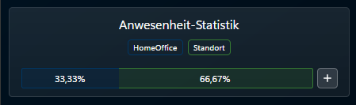
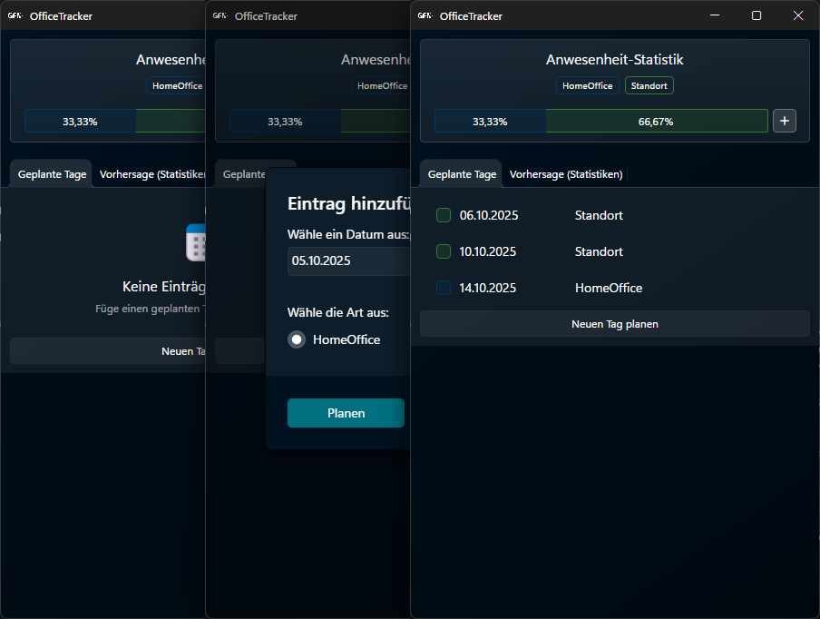

<!-- Last updated: 2025-10-05 | Version 1.0.0 -->

[English](README.md) | **Deutsch**

> **Übersetzungsstatus:** ✅ Vollständig | 🪧 Zuletzt aktualisiert: 05.10.2025

---

# Über das Projekt

Der **Office-Tracker** wurde neben meiner aktuellen Umschulung zum Fachinformatiker Anwendungsentwicklung als kleines Nebenprojekt angefangen und umgesetzt. Die Idee war, dass meine anderen Mitschüler als auch meine Wenigkeit ein kleines Hilfsprogramm haben um die Anwesenheitsquote im Blick zu haben. Der Plan, mit dieser Desktop-Anwendung ist es, dies stetig weiterzuentwickeln und es als Open-Source-Projekt anzubieten, damit auch andere die Lust drauf haben zu unterstützen.

## ✨ Features im Überblick

### 🚀 Schneller Start mit dem Setup-Assistenten
Beim ersten Start führt dich ein einfacher Assistent durch die paar notwendigen Schritte durch, um Anfangsdaten zu haben, mit dem die Anwendung arbeiten kann. Du wirst einen Namen angeben können, deine Tage an denen du standardmäßig Home-Office hast (Mo. – Fr.) sowie deine Ziel-Quote die du mindestens/höchstens haben kannst, ohne in Schwierigkeiten zu kommen. Am Ende bekommt man noch eine kleine Zusammenfassung und kann seine angegebenen Daten nochmals überprüfen & gegebenenfalls auch zu den Schritten zurückkehren, um noch Änderungen vornehmen zu können.

### 🗓️ Tägliche Anwesenheit erfassen
Trage ganz einfach jeden Tag maximal 1x ein, ob du dich im Home-Office oder am Standort/Büro befindest. Dazu reichen 2 einfache Klicks aus – fertig!

### 📊 Anwesenheits-Statistiken
Im oberen Bereich der Anwendung hast du jederzeit deine aktuelle Anwesenheits-Statistik im Auge und siehst mit einem Blick, wie das Verhältnis zu deiner Zielquote ausschaut.

### 🔮 Wochen-Vorhersage (Statistiken)
Basierend auf deine aktuelle Anwesenheits-Statistik und mit deinen geplanten Tagen, berechnet die Anwendung eine Art Prognose für die kommenden Wochen aus. So siehst du frühzeitig und ohne selbst rechnen zu müssen, wann deine Zielquote wieder erreicht ist. Weitere Details und Angaben sind hier bereits geplant.

### 📝 Tage planen
Du hast die Möglichkeit, wie oben bereits kurz angeschnitten – Tage zu planen. Trage im voraus bereits ein, ob du einen standardmäßigen Home-Office-Tag zu einem Standort/Büro Tag – oder andersrum machst. Dies soll dabei helfen deine Planung hinsichtlich zu deiner Zielquote besser zu managen ohne viel Stress, den man eh zur Genüge im Alltag bereits hat.

### 💾 Lokale Datenspeicherung
Die Daten werden auf keinen externen Server gespeichert, sondern ist mit einer SQLite Datenbank versehen. Keine Cloud oder sonstiges – alle Informationen sind also zu 100 % unter deiner Kontrolle. Du brauchst einen neuen Datensatz? Kein Problem – einfach die Data-Bash Datei entfernen/verschieben und das Programm führt dich erneut durch den Assistenten.

---

## 🛠️ Installation

1.  Laden die neueste Version vom Office-Tracker für dein Betriebssystem von den [Releases](https://github.com/JumpSpinn/gfn-office-tracker/releases) herunter.
	* `OfficeTracker-win-x64.exe` für Windows
	* `OfficeTracker-linux-x64` / `.zip` / `.tar.gz` für Linux
2.  Entpacken ggbf. die heruntergeladene Datei (falls es eine .zip/.tar.gz ist).
4.  Führe die `OfficeTracker.exe` (Windows) oder die `OfficeTracker` ausführbare Datei (Linux) aus.

---

## 📄 Lizenz

Dieses Projekt ist unter der MIT-Lizenz lizenziert - siehe die [LICENSE.md](LICENSE.md)-Datei für Details.

---
